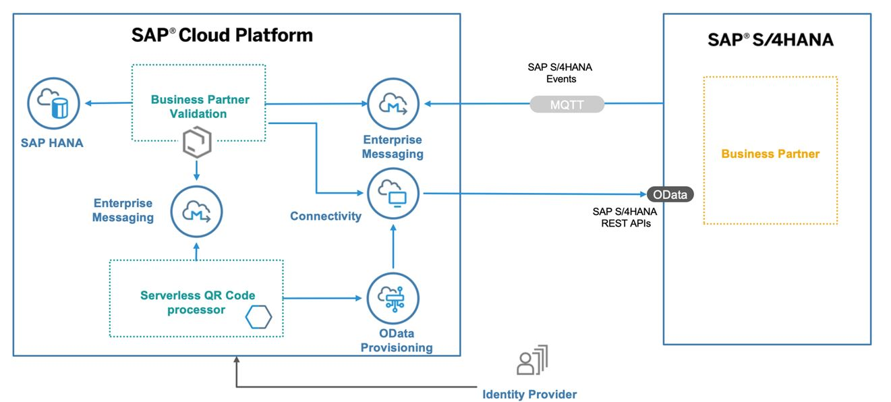
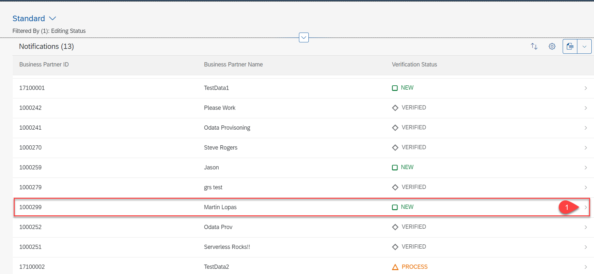
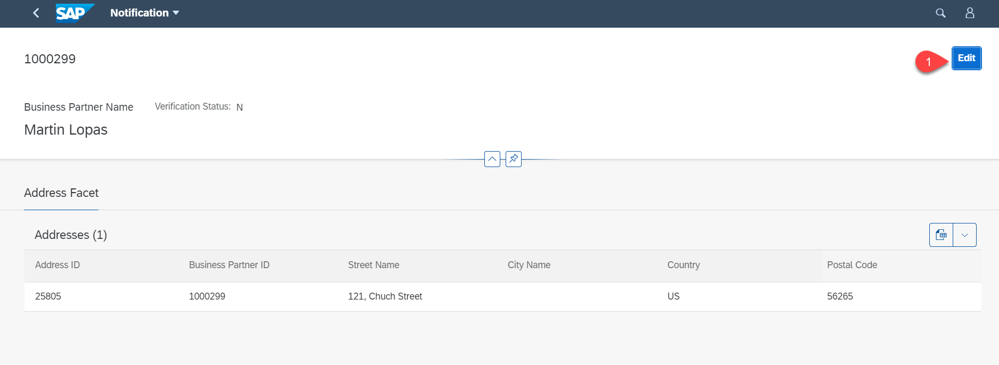
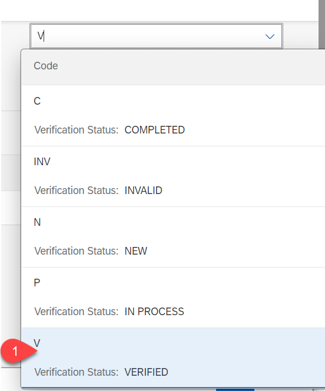

# S/4 HANA Extend Business Process Scenario

## Description
The main intent of this scenario is to complement an existing business process in an SAP solution – currently SAP S/4HANA with additional business process steps. This involves adding major logic and/or additional data and goes beyond simple UI changes.

This application showcases:

- Building application on SAP Cloud Platform(CP) using [SAP Cloud Application Programming Model(CAP)](https://cap.cloud.sap/docs/)
- Consuming Events from S/4 HANA on premise using [SAP CP Enterprise Messaging](https://help.sap.com/viewer/bf82e6b26456494cbdd197057c09979f/Cloud/en-US/df532e8735eb4322b00bfc7e42f84e8d.html)
- Consuming REST API's from S/4 HANA on premise using SAP CP Connectivity Service
- Building and deploying a function in [SAP Cloud platform Serverless Runtime](https://help.sap.com/viewer/bf7b2ff68518427c85b30ac3184ad215/Cloud/en-US/7b8cc2b0e8d141d6aa37c7dff4d70b82.html)

## Business Scenario

A business scenario is used to showcase how to build a S/4 HANA on premise extension Application on SAP CP.

John who is an employee of Business Partner Validation Firm iCredible, which is a third-party vendor of ACME Corporation would like to get notifications whenever new Business Partners are added in the S/4 HANA backend system of ACME Corporation. John would then be able to review the Business Partner details in his extension app. He would proceed to visit the Business Partner’s registered office and do some background verification. John would then proceed to update/validate the verification details into the extension app. Once the details are verified, the Business Partner gets activated in the S/4 HANA system of ACME Corporation.

- Custom extension application that works independently from S/4 HANA.

- Changes in S/4 communicated via events in real time to extension application.

- Compute intensive processing available on demand (serverless environment).

- Vendor personnel needs access to only custom app

## Architecture

### Solution Diagram



The Business Partner Validation application is developed using SAP Cloud Application programming Model (CAP) and runs and runs on the SAP Cloud Platform Cloud Foundry Environment. It consumes platform services like Enterprise Messaging, SAP HANA and Connectivity. The events generated in S/4 HANA on premise are inserted into the Enterprise messaging queue. The application running in Cloud Foundry polls the queue for these messages and inserts them into the HANA database. The Business Partner Validation Application also uses S/4 HANA REST API's to read data from Business Partner Data from S/4 HANA system. The Business Partner Validation App also places the processed events into a Enterprise Message Queue from where a Serverless Application consumes it and posts it back to S/4 HANA on premise system using OData provisioning.

## Requirements
* S4 Hana on premise system.
* SAP Cloud Platform account

### For local development you would require the following:
* [Node js](https://nodejs.org/en/download/)
* [Cloud Foundry Command Line Interface (CLI)](https://github.com/cloudfoundry/cli#downloads)
* [Visual Studio Code](https://cap.cloud.sap/docs/get-started/in-vscode)
* [cds-dk](https://cap.cloud.sap/docs/get-started/)
* [SQLite ](https://sqlite.org/download.html)
* To build the multi target application, we need the [Cloud MTA Build tool](https://sap.github.io/cloud-mta-build-tool/), download the tool from [here](https://sap.github.io/cloud-mta-build-tool/download/)
* For Windows system, install 'MAKE' from https://sap.github.io/cloud-mta-build-tool/makefile/
* [multiapps plugin](https://github.com/cloudfoundry-incubator/multiapps-cli-plugin) - `cf install-plugin multiapps`  
*  mbt -  `npm install -g mbt`

### Entitlements

The application requires below set of SAP Cloud Platform Entitlements/Quota

| Service                           | Plan       | Number of Instances |
|-----------------------------------|------------|:-------------------:|
| Enterprise Messaging              | default    |          1          |
| SAP HANA Schemas & HDI Containers | hdi-shared |          1          |
| SAP Hana Service                  | 64standard |          1          |
| Application Runtime               |            |          1          |
| Extension Factory Runtime         |            |          1          |


## Configuration


### Step 1: Setup Cloud platform subaccount

You can use [Cloud Platform - Boosters](https://help.sap.com/viewer/DRAFT/65de2977205c403bbc107264b8eccf4b/Validation/en-US/fb1b56148f834749a2bf51127421610b.html) to setup the subaccount. Boosters Will create the subaccount with the required entitlements, subscriptions and assign the required roles to your user to run this application. Steps to run the booster are provided in [link](./documentation/mission/Prepare-Cloud-Platform/Booster.md). You can create subaccount manually also following [link](./documentation/mission/Prepare-Cloud-Platform/README.md)

### Step 2: [S/4 HANA Enable OData Service for business partner](./documentation/mission/configure-oData-Service/README.md)

### Step 3: [Setup connectivity between S4Hana system, SAP CP](./documentation/mission/cloud-connector/README.md)

### Step 4: Build and deploy the CAP application

#### Steps to deploy locally

- Open terminal in VSCode
- Run `cds watch`

#### Steps to deploy the application on CF

1. Build the application
    `mbt build -p=cf `  
2. Login to Cloud Foundry by typing the below commands on command prompt
    ```
    cf api <api>
    cf login -u <username> -p <password>
    ```
    `api` - [URL of the Cloud Foundry landscape](https://help.sap.com/viewer/65de2977205c403bbc107264b8eccf4b/Cloud/en-US/350356d1dc314d3199dca15bd2ab9b0e.html) that you are trying to connect to.

    Select the org and space when prompted to. For more information on the same refer [link](https://help.sap.com/viewer/65de2977205c403bbc107264b8eccf4b/Cloud/en-US/75125ef1e60e490e91eb58fe48c0f9e7.html#loio4ef907afb1254e8286882a2bdef0edf4).

3. Deploy the application

	Navigate to mta_archives folder and run the below command from CLI

   `cf deploy BusinessPartnerValidation_1.0.0.mtar`

### Step 5: [Build and deploy the serverless application](./serverlessQRCodeGenerator/README.md)

### Step 6: [Configure event based communication between S4 and enterprise messaging](https://help.sap.com/viewer/810dfd34f2cc4f39aa8d946b5204fd9c/1809.000/en-US/fbb2a5980cb54110a96d381e136e0dd8.html)


## Demo script

1. In the command line interface run the command `cf apps`
   
2. Find the URL for the app ` BusinessPartnerValidation-ui` - this is the launch URL for the Business Partner Validation application.

3. Launch the URL in a browser.

4. Click on Business Partner Validation tile


5. The list of BusinessPartners along with their verification status gets displayed. 


6. Login to the S4 Hana on-premise system


7. Enter transaction code 'bp'


8. Click on Person


9. Provide first name, last name for the business partner


10. Provide the address


11. Move to the status tab and check mark the 'Central Block' lock. Save the BP. This will create a new Business Partner 


12. Now go back to the BusinessPartnerValidation application to see if the new BusinessPartners has come on the UI


13. Go to the details page for the new BusinessPartner. Click on edit.


14. Change the Verification Status to VERIFIED. You can also edit the street name, postal code also if needed. Save the data. 


15. Open S4 Hana system, bp transaction. Search for the newly created bp


16. Click on the BP


17. You can see that the central Block lock has been removed 


18. The serverless application has also uploaded a QR code for the address details of the BP to the S4Hana system. 
You can view this by clicking on the icon in the top left corner. You will have to give permission for downloading the image. 


19. You can also notice that in the BusinessPartner Validation UI, the status is now set as COMPLETED.

## Known Issues

No known issues.

## How to Obtain Support

In case you find a bug, or you need additional support, please open an issue here in GitHub.

## License
Copyright (c) 2020 SAP SE or an SAP affiliate company. All rights reserved. This file is licensed under the Apache Software License, version 2.0 except as noted otherwise in the [LICENSE](LICENSES/Apache-2.0.txt) file.

