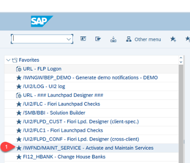
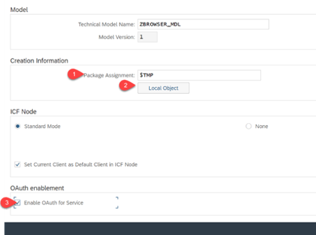
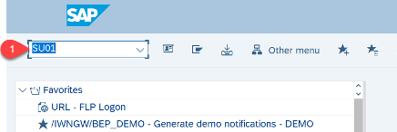
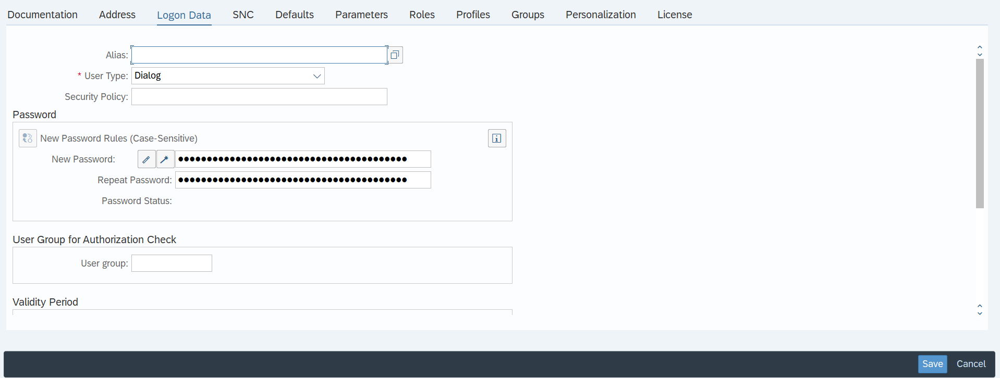
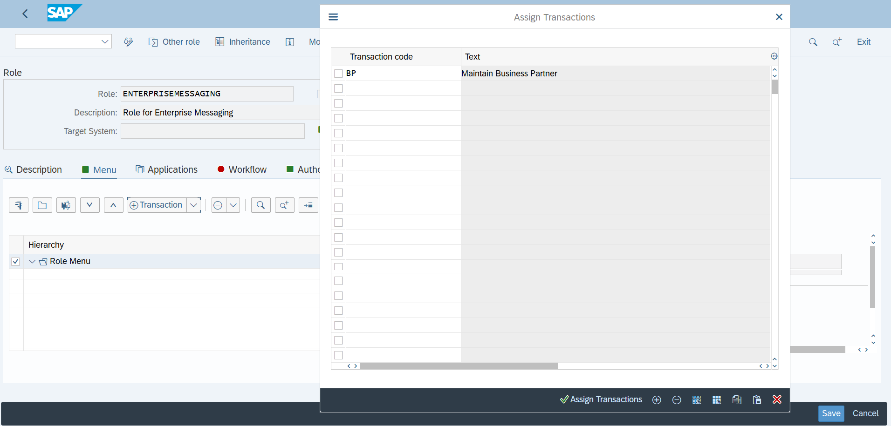
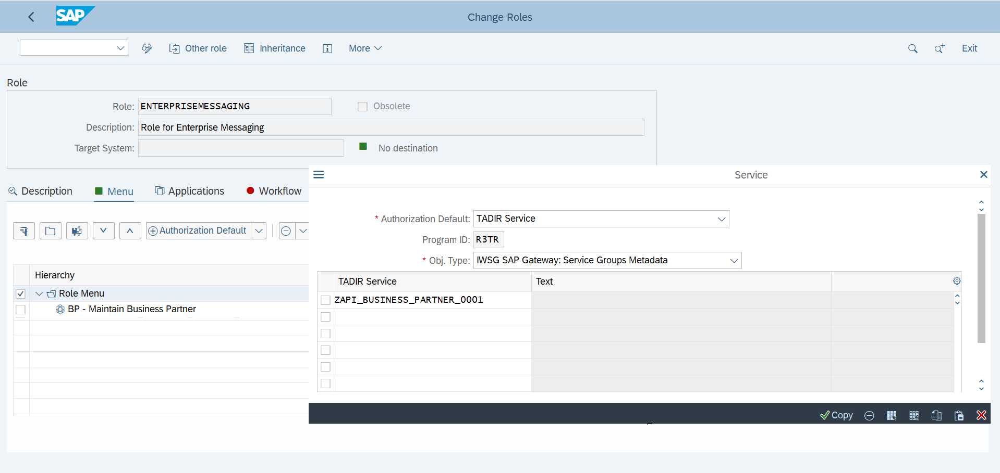
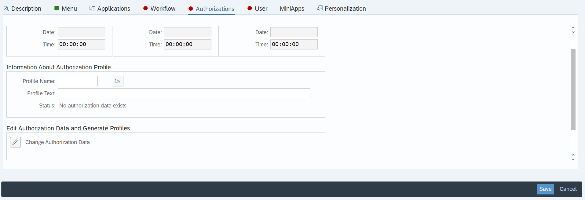
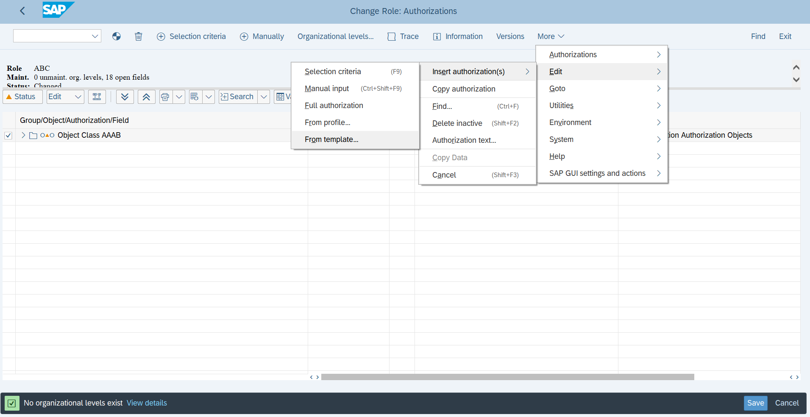
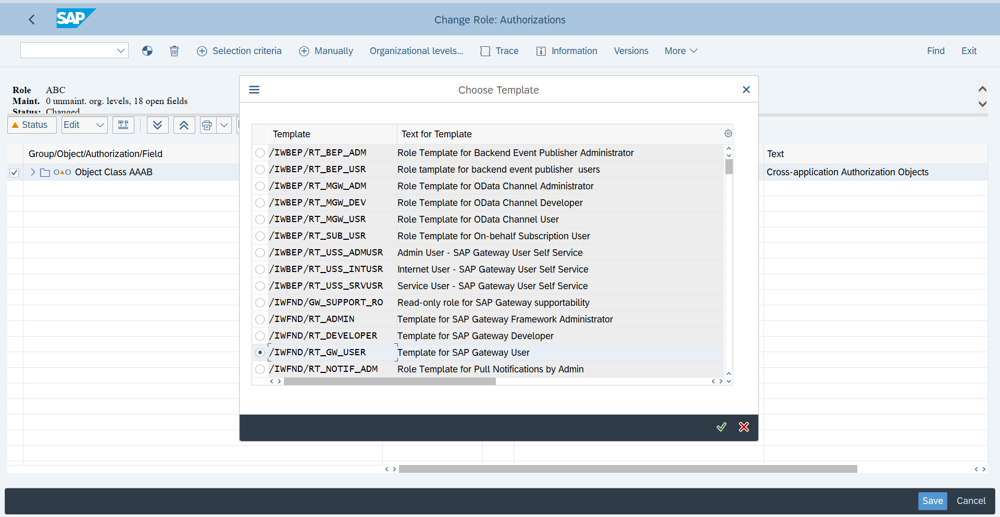
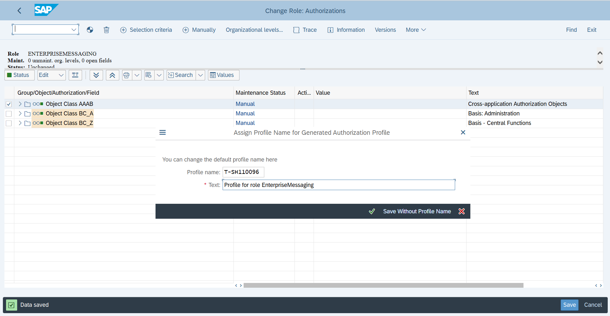

# Prepare SAP S/4HANA System by activating the suitable OData service and creating a technical user in SAP S/4HANA system 

## Introduction

We are going to activate our Business Partner OData service and create a technical user in our SAP S/4HANA backend system.

**Persona:** S/4HANA Admin

### Activate OData service in S/4 HANA on premise backend system

1.	Open your S/4HANA on premise system
2.	Navigate to transaction code: '/IWFND/MAINT_SERVICE'

   

3.	Click on *Add Service* in the Service Catalog

   

4.	Enter *System Alias* 'LOCAL',  *External Service Name* 'API_BUSINESS_PARTNER' and click enter to search for all matching services
5.	Choose the checkbox to select service and click on *Add Selected Services*

   
   
6.	On the next screen specify *Package Assignment* e.g. $TMP by clicking on *Local Object*
7.	Check checkbox for "Enable OAuth for Service“ and click on *Continue*

   
   
### Create Technical User and Assign Role

Now we are going to create a user in our SAP S/4HANA backend and assign the required authorizations. 

1.	Go back to your initial screen and navigate to transaction code: 'SU01'

   
   
2.	Enter your Technical User in the field *User*

   
   
3.	Change *User Type* to 'Dialog'
4.	Create a new *Password* for your User and repeat it to verify
5.	*Save* your Technical User with the save button

   

6.	Navigate to transaction code: '/nPFCG'
7.	Enter 'ENTERPRISEMESSAGING' in the *Role* field, then click on the *Single Role* button

 

8.	On the next screen enter a description first, then switch to the *Menu* tab and *save* the role in the pop-up window
9.	Click on the *Transaction* button on the menu tab to enter a new Transaction
10.	Enter the transaction code for which you need to provide access in the pop-up window. In our case enter 'BP'
11.	Click on *Assign Transactions* to finish

     
   
12.	Select 'Authorization Default' from the 'Transaction dropdown' in the menu tab
13.	In the pop-up window. Select 'TADIR Service' as Authorization Default from the pull down menu, and change *Object Type* to 'IWSG SAP Gateway: Service Groups Metadata'
14.	 Enter the name of active Business Partner API - you can look this up using the menu - into to the table and click on *Copy*
   
      
   
15.	Now switch to the *Authorizations* tab and click on *Change Authorization Data* 

    
   
16.	Don´t forget to *Save* the role first
17.	Navigate to *Edit->Insert Authorizations -> From template*

18.	Search for '/IWFND/RT_GW_USER' in the pop-up window and click on the checkmark to apply the template

      

19.	Search for '/IWXBE/RT_XBE_ADM' and follow instructions in Step *17 & 18*
20.	Now click on *Status*, then generate with clicking the icon on the top and *save* the profile in the pop-up
21.	Click on the *generate icon*

   
   
22.	Go back and Switch to the *User* tab, select your technical user and click on *User Comparison* and click on full comparisons in the pop up   
23.	Log off from the admin user system by entering the transaction '/nEX'
24.	Log on to the GUI using your newly created Technical User
