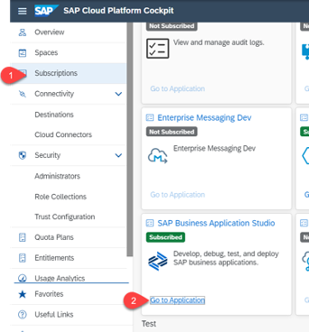
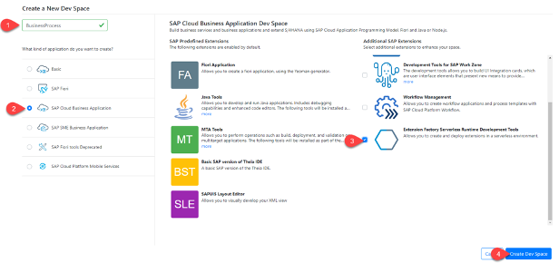
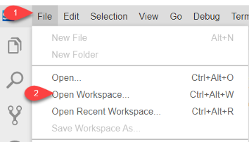
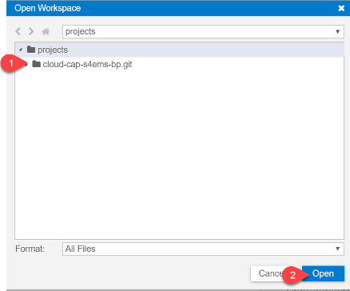
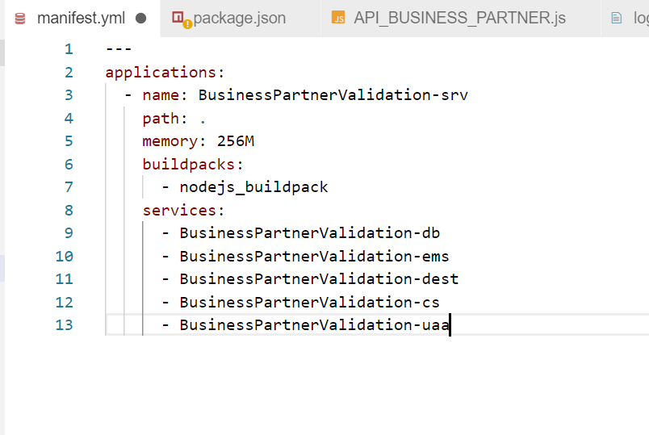
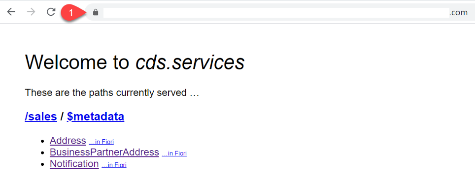

# Develop SAP Cloud Application Programming Model Application

## Introduction

In this how to guide, you will create a new CAP application in SAP Business Application Studio and test your application.

**Persona:** SCP Developer

### Create a new application in SAP Business Application Studio

1.	Make sure you have opened your *SAP Cloud Platform Account* and navigate to your *Subaccount* 
   
2.	Open the menu *Subscriptions* and then search for 'Business Application Studio'. Click on *Go to Application*.

    
   
3.	Open the application 'Business Application Studio' and login via your username and password

     
 
4.	In Business Application Studio click the button *Create Dev Space*

     
 
5.	On the next screen enter a Dev space name e.g 'BusinessProcess', select the type *SAP Cloud Business Application*. Mark    *Serverless Runtime Development Tools* under additional tools. 
    Don´t forget to click on the button *Create Dev Space*

      
      
 
6.	Your Dev Space is now being created. As soon as the Dev Space is available you can click on your Dev Spaces name to  access

7.	Choose *Terminal -> New Terminal* in the menu on the top of your screen.

    
 
8. Go to projects Folder
   
   ``` 
   cd projects
   ``` 
 
9.	Clone the project from GitHub: 

    ```
    git clone https://github.tools.sap/refapps/cloud-cap-s4ems-bp.git
     ```
 
10.	Click on *File* in the menu on the top and choose *Open Workspace* in the drop down.

    
 
11.	Open the project by selecting projects -> cloud-cap-s4ems-bp and click on *Open*

    
 
12.   For the next steps you need the terminal again. Go to *Terminal* -> *New Terminal*
     
   i. First you need to login:
 
    
    cf api <api endpoint>
    cf login -u <user id> -p <password>
    cf target -o org -s space
    
         
   ii. Then you will get the guid of your HANA service. Please note that, in case that you do not have a HANA service in    your SAP Cloud Platform environment yet, you will have to create one. You can find a tutorial for creating a HANA Service instance [here](https://help.sap.com/viewer/cc53ad464a57404b8d453bbadbc81ceb/Cloud/en-US/21418824b23a401aa116d9ad42dd5ba6.html).
     
  
      cf service <HANA-Service> --guid
      cf cs hana hdi-shared BusinessPartnerValidation-db -c '{"database_id" : "<guid of HANA Service>"}'
   
            
   
   iii. In a next step, using the guid of your HANA  service, you will create a number of services e.g. for HANA and Enterprise Messaging. You will do this executing the Cloud  Foundry Create Service command.
   
     
    cf cs enterprise-messaging default BusinessPartnerValidation-ems -c em.json
    cf cs destination lite BusinessPartnerValidation-dest
    cf cs xsuaa application BusinessPartnerValidation-xsuaa -c xs-security.json
    cf cs connectivity lite BusinessPartnerValidation-cs
    cds build --production
               
> HINT: there is an additional way of deployment - either execute the steps before or the two below to achieve the same result: Run *mbt build -p=cf* followed by cf *deploy mta_archives/BusinessPartnerValidation_1.0.0.mtar*


13.	 Open the manifest.yaml file and add your service names / replace existing ones with your services: ems, dest, xsuaa, database. Then open the manifest.yaml in gen/srv as well and add the services there as well.

> Hint: to make sure that the services names match, execute the CF command *CF services* which lists the services you have created including their names.

 
 
14.	Go back to the terminal and run following commands:

       ```
       cf p -f gen/db
       cf p -f gen/srv --random-route
       ```

 
  
 
15.  Go to the terminal and execute *CF apps*, then copy the URL of the BusinessPartnerValidation-srv which you should now see listed

16. Go to *< Your Project Directory >/app/BusinessPartners* in your Business Application Studio and open the *manifest.yml* in that folder

   i. Replace the URL in the manifest file (env -> destinations --> service-binding) with the one you have just copied. Make sure you add an *https://* in the beginning of the URL.

   ii. Add your xsuaa service to the services like you have done in the other manifest.yml file above.

> Hint: you can check on your service names using *CF services*

17. Go to the terminal again and execute the below command
   
      
         cf p -f app/BusinessPartners --random-route


### Test your application

1. Go to the terminal and enter *cf apps*.

 

2. Copy the UI url.

3. Open your browser and paste the URL in there. Press enter. Enter user and password.

 
