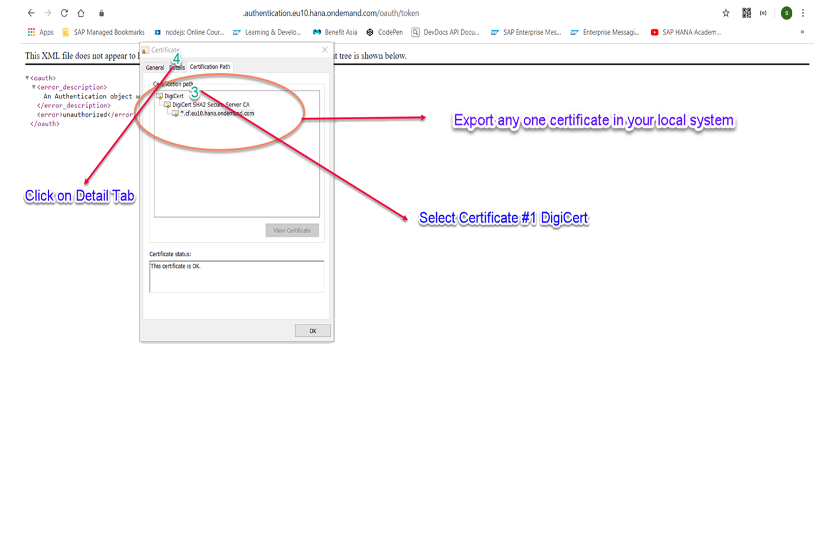
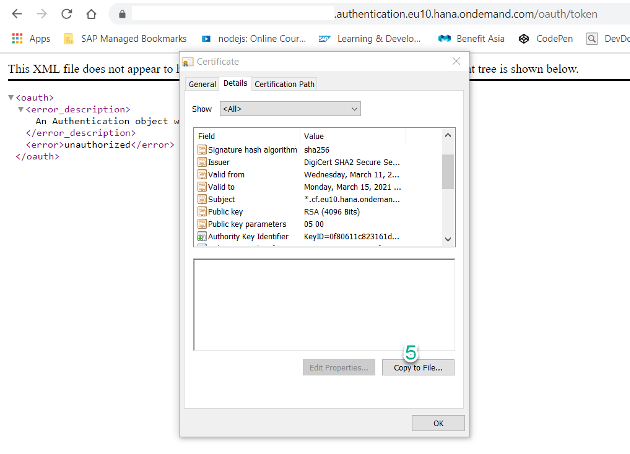
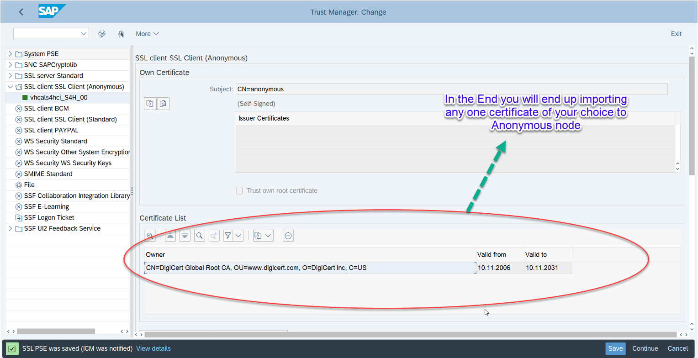
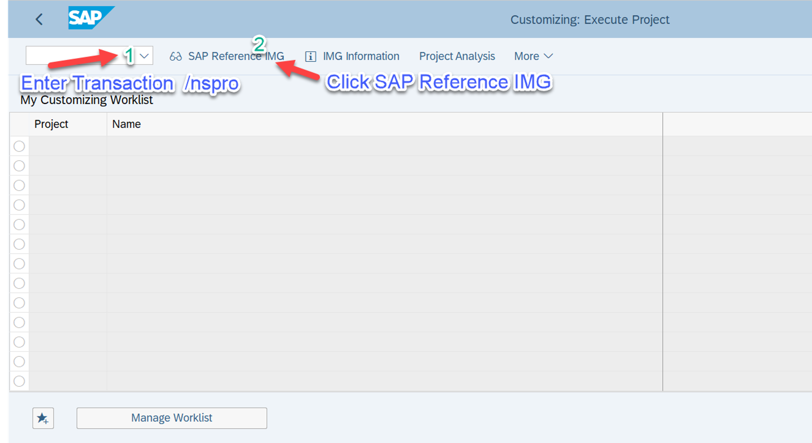
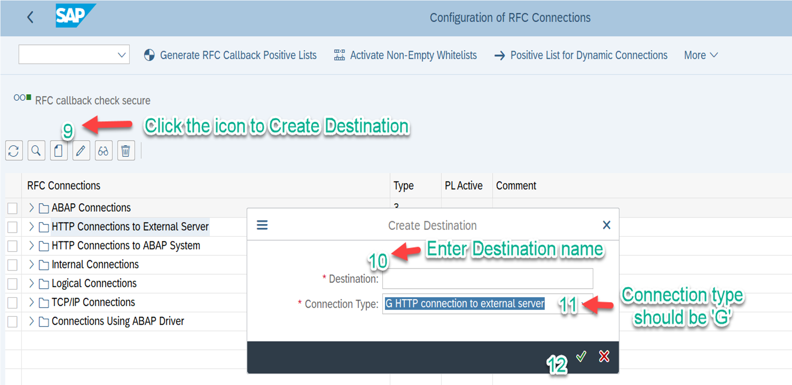
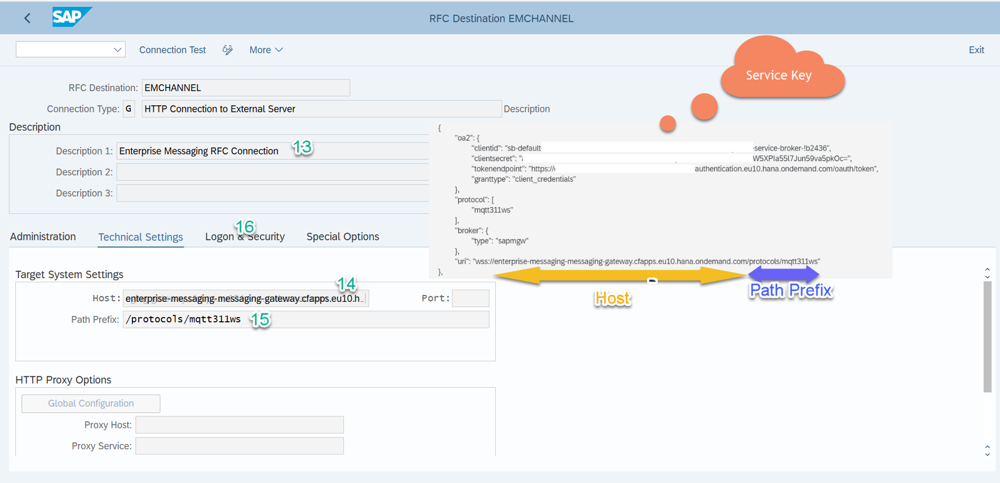
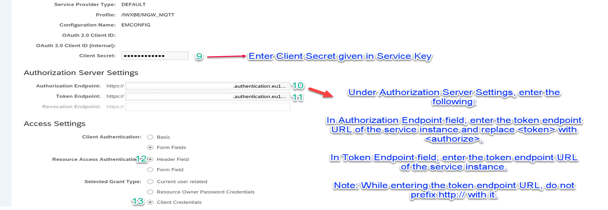
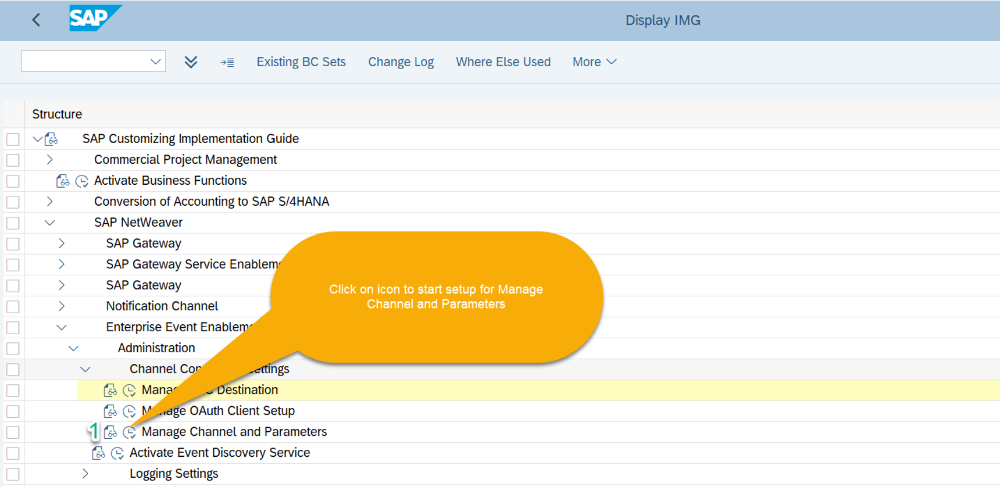
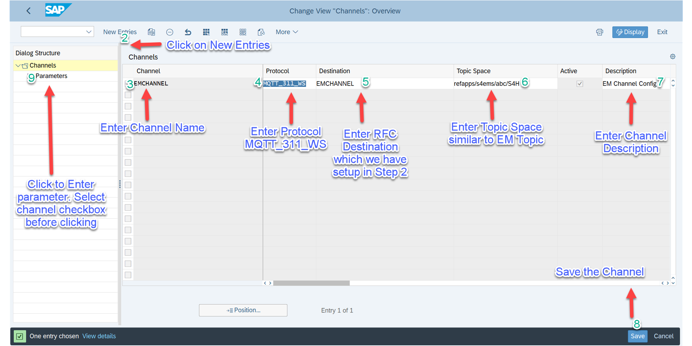
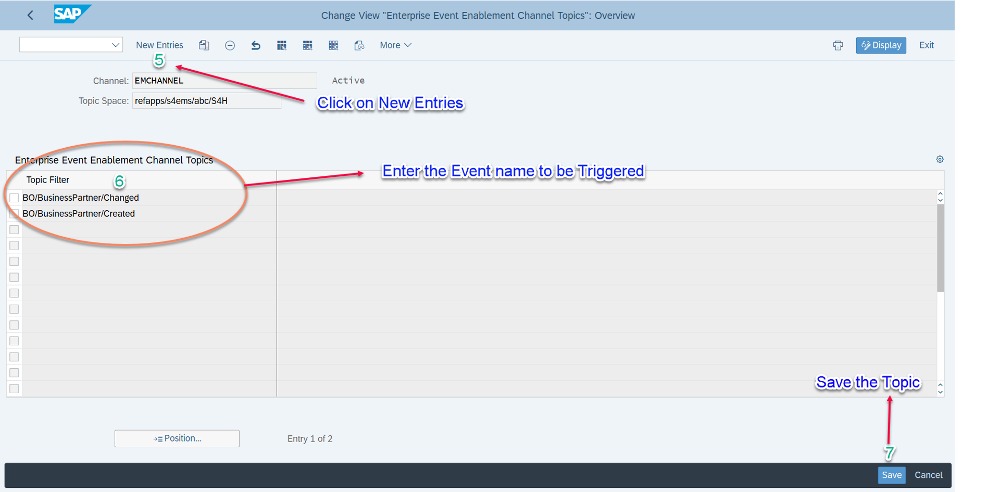

# Configure event based communication between S/4 and SAP Cloud Platform Enterprise Messaging
## Introduction

In this how to guide, you will establish a connection between your S/4 HANA on Premise System and Enterprise Messaging. This connection is needed to transport events from the SAP S/4HANA system to Enterprise Messaging. 

Additional documentation on configuring trust and creating the RFC destination can be found  in the official guide:
 
https://help.sap.com/viewer/810dfd34f2cc4f39aa8d946b5204fd9c/1809.000/en-US/12559a8c26f34e0bbe8c6d82b7501424.html

**Persona:** S/4 HANA Developer

### Configure Endpoint

1. Open your browser. Then go to your sub account in SAP Cloud Platform and from there to your BusinessPartner space. 
2. Click on *Service Instances* (on the left).
3. Click on your Enterprise Messaging instance.

 

4. Find and copy your Enterprise Messaging token endpoint URL. Look for tokenendpoint and then copy the URL.

 

5. In your browser, open your Enterprise Messaging token endpoint url (*https:// ... Enterprise Messaging URL ... /oauth/token*). 

6. Click on view site information button (lock symbol on top left corner)and open the *certificate*

 

7. Import a certificate
> Hint: You can either download the DigCert certificate on the digicert website or follow the steps below. The steps for exporting the certificates might work differently depending on your browser and operating system. On a Mac for example, you could just drag and drop the certificates to a folder in your file system. 

7.1 Choose the tab *certificate path* and double click on "DigCert" 

Hint: it is sufficient to export any of the three certificates. Later on you will import only a single one.

 

8. Next choose the tab *Details* and click on the buttoon *Copy to files*, then choose *Next*

 

9. Click on *Next*. Then, on the next screen, click on *Next* again

 

10. Then copy your file name into the empty space (Alternatively you can browse for the file)

 

11. Click on *Next*, then *Finish*

 

12. In the pop-up window click on *Ok* for confirmation 

 

13. Go back to your S/4HANA system
14. Go to transcaction - 'STRUST'.

 

15.	Switch to Change mode
16.	Right Click on SSL client SSL Client (Anonymous) and Select *Create*
17. Click Enter
18. Click Save
19. Double Click on SSL Anonymous Node
20. Import  the Certificate from local folder
21. Save

 

You will end up importing a single certificate of choice to the Anonymous Node.

 

22. Enter transaction  "/nsmicm" to go and clear the cache.
23. Navigate to Administration -> iCM -> Exit soft -> Local
24. Click on *Yes* to finish

25. Enter the transaction '/nspro', then click on *SAP Reference IMG* button to execute

 

26. Now you need to navigate in the structure to configure a RFC Connection
27. Navigate to SAP NetWeaver -> Enterprise Event Enablement -> Administration -> Channel Connection Settings ->

 

28. Click on Manage RFC destination and click on the execute icon
29. On your new screen choose the icon to create a new destination
30. Enter a destination name 'EMS4' and select connection type 'G Http connection to external server' from the drop down

 

31. Click on the check icon to finish
32. Enter host name - enter the service key from em. <app-url> eg: enterprise-messaging-messaging-gateway.cfapps.eu10.hana.ondemand.com
 
  
 
33. Enter path prefix - /protocols/mqtt311ws
34. Click on ‘logon and security‘ tab

  

35. Scroll to security options 
36. Select SSL client 'Anonymous'
37. Click on radio button "active"  for SSl
38. Click on *save*
39. Click on *back* 
40. Click on *back*
41. On the next screen click on the *execute icon* for "manage Oauth client setup"

  

42. Change the port from 44301 to 44300 in the url
43. Open the Logon and use your Technical User credentials to log into the system

  

44. On the next screen click on the *create* button to create a new OAuth 2.0 Client

  

45. Enter field name  '/IWXBE/MGW_MQTT' for *OAuth 2.0 Client profile* or select it from the drop down
46. Enter a Configuration Name for the auth 'refappsEMAuth'
47. Enter OAuth client ID

  

48. Click on OK to finish

49. Click on *Details* tab and choose *Administration* 

50. Enter *Client Secret* given in the Service Key

  

51. Enter *Authorization Endpoint* and *Token Endpoint*.  Replace *token* with *authorize* in the url for the authorization endpoint. 
52. For *Resource access authentication* choose *Header Field*
53. For *Grant Type* choose *Client Credential*
54. Don´t forget to click on *Save*

  
 
  

55. Go back to the Screen Display IMG
56. Click on the icon to execute 'Manage Channel and Parameters'

 

57. Click on *New Entries*

 

58. Enter 'EMChannel' in the channel tab of the table
59. Select the protocol 'MQTT_311_WS’'
60. Enter 'EMS4' destination 
61. Enter the topic name created in CP

To identify your topic name, go the the SAP Cloud Platform Cockpit and click on *Subscriptions*. Look up the *Enterprise Messaging* tile. Click on *Go to Application*. This opens up Enterprise Messaging. Click on your messaging client and copy the value under *Namespace*. 

62. Enter a Description
63. Click on save to finish
64. Select EMChannel
65. Double click on parameters

66. Click on *new entries*
67. Configure your channel as described in the following:
- *Parameter name* "MAX_RECONNECT_ATTEMPTS" -->  Leave the parameter value field empty.
- *Parameter name* MQTT_QOS --> *Parameter value* 1
- *Parameter name* OAUTH_20_CLIENT_PROFILE  -->  *Parameter value* /IWXBE/MGW_MQTT
- *Parameter name* OAUTH_20_CONFIGURATION --> *Parameter value*  EMCONFIG (the name you had used earlier in step 50 for the auth 'refappsEMAuth')
- *Parameter name* RECONNECT_WAITTIME --> Leave parameter value field empty. 

68. Click on *Save*

 

69. Click on *back* 
70. Click on *display/ change*

 

71. Select the channel
72. Click on *active- inactive* button

Make sure the channel is active.

73. Test the connection

 

74. click on *Back* and go back to the Screen Display IMG
75. Click on *Configuration*
76. Click on *Maintain Event Topics*

 

77. Enter channel 'EMChannel' created in the steps before
78. Click on the check icon to finish

79. Change to screen: Change View - Enterprise Event Enablement Channel Topics: Overview	
80. Click on *New Entries*

 

81. Click on the *mirror ico*n or press F4 in keyboard
82. Select BO/BusinessPartner/Created in the Topic Filter field
83. Click on the mirror icon or press F4 in keyboard
84. Select BO/BusinessPartner/Changed in the Topic Filter field
85. Click on *Save* to finish
